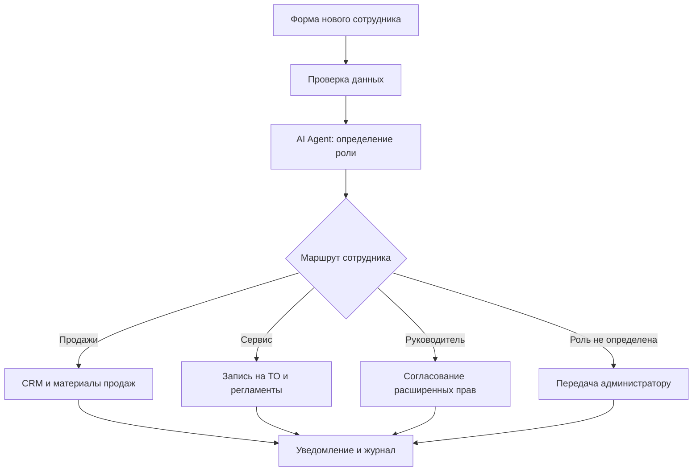

# AI-агент адаптации сотрудников AutoSfera AI

> Статус: концепция отдельного sub-workflow. Функции, описанные ниже, не считаются реализованными до сборки и тестирования сценария в n8n.

## Назначение

Агент автоматизирует подключение нового сотрудника автосалона: принимает данные из формы, определяет рабочую роль, формирует набор доступов и задач, выдаёт материалы для адаптации и уведомляет ответственных.

## Входные данные

- ФИО сотрудника;
- должность;
- подразделение;
- филиал;
- дата выхода;
- руководитель;
- рабочие контакты;
- выбранный наставник, если он назначен заранее.

## Основной сценарий

1. Руководитель или администратор заполняет форму нового сотрудника.
2. n8n проверяет обязательные поля и корректность данных.
3. AI Agent определяет роль сотрудника и предлагает подходящий маршрут адаптации.
4. Узел Switch направляет заявку в соответствующую ветку.
5. Система создаёт профиль, задачи и уведомления.
6. Действия записываются в журнал.
7. Операции с критическими правами выполняются только после подтверждения ответственного сотрудника.

## Ролевые ветки

### Менеджер по продажам

- доступ к CRM в пределах своей роли;
- каталог автомобилей и актуальные предложения;
- скрипты продаж и правила обработки лидов;
- задачи на изучение стандартов коммуникации;
- подключение к рабочему каналу отдела продаж.

### Сервисный консультант

- доступ к системе записи на техническое обслуживание;
- сервисные регламенты и инструкции;
- шаблоны общения с клиентами;
- задачи по изучению стандартов сервиса;
- подключение к рабочему каналу сервисного отдела.

### Руководитель

- доступ к управленческим отчётам и аналитике;
- задачи по контролю адаптации сотрудника;
- расширенные права только после ручного подтверждения;
- подключение к каналу руководителей.

### Неизвестная или неоднозначная роль

- автоматическая выдача критических прав запрещена;
- заявка передаётся администратору;
- сотруднику отправляется уведомление о ручной проверке.

## Схема n8n



Краткая цепочка узлов:

`Form Trigger → Validate Data → AI Agent → Switch by Role → Create Profile → Approval → Grant Access → Create Tasks → Notify → Audit Log`

## Интеграции

- n8n — оркестрация процесса;
- CRM AutoSfera — профиль сотрудника и права в пределах роли;
- PostgreSQL — состояние процесса, история и журналирование;
- база знаний/RAG — инструкции, скрипты и материалы;
- Telegram или Slack — уведомления и рабочие каналы;
- Jira или внутренняя система задач — план адаптации;
- Microsoft Entra ID или другой корпоративный каталог — только при фактическом использовании заказчиком.

## Контроль и безопасность

- AI Agent предлагает маршрут, но не выдаёт критические права самостоятельно.
- Персональные данные передаются только в необходимые системы.
- Все изменения прав журналируются.
- Ошибки интеграций направляются ответственному сотруднику.
- Для повторного запуска используется идентификатор заявки, чтобы не создавать дубли.
- Секреты и токены хранятся в Credentials n8n или переменных окружения, но не в workflow и не в репозитории.

## Результат работы

Успешное выполнение возвращает единый ответ:

```json
{
  "request_id": "uuid",
  "employee_id": "internal-id",
  "role": "sales_manager",
  "status": "completed",
  "accesses": ["crm_sales", "knowledge_base"],
  "tasks_created": 5,
  "approval_required": false,
  "notifications_sent": true
}
```

При необходимости ручного решения:

```json
{
  "request_id": "uuid",
  "status": "waiting_for_approval",
  "approval_required": true,
  "reason": "unknown_role_or_privileged_access"
}
```

## Критерии готовности MVP

- корректно обрабатываются четыре ролевых маршрута;
- обязательные поля формы валидируются;
- повторная заявка не создаёт дубликаты;
- критические права требуют ручного подтверждения;
- задачи и уведомления создаются только после успешного сохранения профиля;
- каждый шаг фиксируется в журнале;
- ошибки приводят к безопасной остановке и передаче ответственному сотруднику.

## Место в архитектуре AutoSfera AI

Модуль оформляется как отдельный sub-workflow **«Внутренние коммуникации и адаптация сотрудников»**. Он подключается к общему n8n-оркестратору и использует единый контракт данных, журналирование и безопасную передачу человеку.

Автор концепции: Степанов Д.А.
